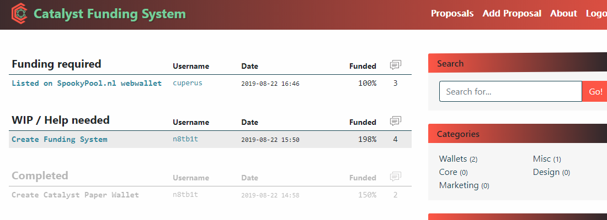

# Funding System

## Why
The Catalyst Funding System was put in to action by members of the Catalyst Community. Our goal is to have our community members fund each other in order to help Catalyst grow.

## About
Right now, it’s still a work in progress, though you can access and test it yourself, and tell us your opinion. Feel free to create your own proposals, and contribute to the active ones.

You are probably asking yourself why, a small project, would ever need such a system? Let me explain!

The Catalyst Funding System was put into action in order to our community members fund each other and help Catalyst grow. It gives an excellent opportunity to independent developers and artists to contribute and to express themselves, and get their work appreciated in CX.

The platform already has a bunch of successfully funded projects, and we hope, that as time goes by more and more will follow.
